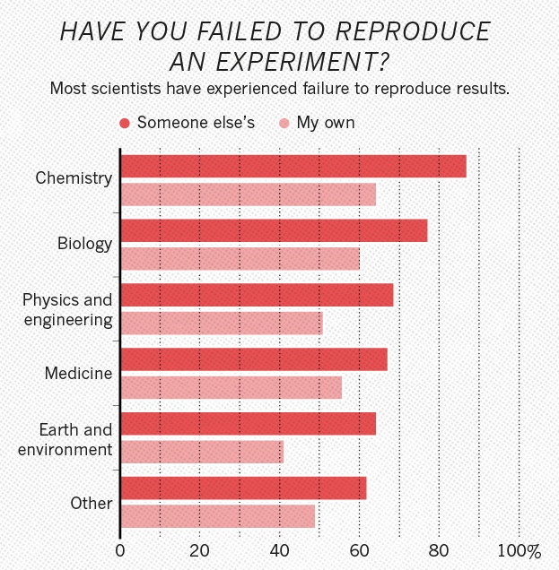

## Computational reproducibility

> ## A reproducibility quote
>
> _An article about computational science in a scientific publication is **not** the scholarship
> itself, it is merely **advertising** of the scholarship. The actual scholarship is the complete
> software development environment and the complete set of instructions which generated the
> figures._
>
> -- Jonathan B. Buckheit and David L. Donoho, "WaveLab and Reproducible Research", [source](https://statweb.stanford.edu/~wavelab/Wavelab_850/wavelab.pdf)
{: .testimonial}

Computational reproducibility has many definitions.  Example: The Turing Way definition of computational reproducibility:
[source](https://the-turing-way.netlify.com/reproducibility/03/definitions.html)

Same data + same analysis = reproducible results

What about real life?

Example: Nature volume 533 issue 7604 (2016) surveying 1500 scientists.
[source](https://www.nature.com/news/1-500-scientists-lift-the-lid-on-reproducibility-1.19970)

Half of researchers cannot reproduce their own results.

## Four questions

Four questions to aid robustness of analyses:

1. **Input data?** Specify all input data and parameters.
2. **Analysis code?** Specify all analysis code and libraries analysing the data.
3. **Compute environment?** Specify all requisite liraries and operating system platform running the analysis.
4. **Runtime procedures?** Specify all the computational steps taken to achieve the result.

Code and containerised environment was covered in previous two days; good!

Today we'll cover the preservation of runtime procedures.

> ## Excercise
>
> Are containers enough to capture your runtime environment? What else might be necessary in your
> typical physics analysis scienarios?
>
{: .challenge}

> ## Solution
>
> Any external resources, such as database calls, must also be thought about. Will the external
> database that you use be there in two years?
>
{: .solution}

## Computational workflows

Use of interactive and graphical interfaces is not recommended, as one cannot reproduce user clicks
easily.

Use of custom helper scripts (e.g. ``run.sh`` shell scripts) or custom orchestration scripts (e.g.
Python glue code) running the analysis is much better.

However, porting glue code to new usage scenarios may be tedious work that is better spent doing
research.

Hence the birth of declarative workflow systems that express the computational steps more
abstractly.

Example of a serial computational workflow:

~~~
  data --> step 1 --> step 2  --> ... --> step N --> results
~~~
{: .source}

Example of a parallel computational workflow:

~~~
     +-->  step 1 ---+
    /                 \
 data                  ---> merge --> results
     \                /
      +--> step 2 --+
~~~
{: .source}

Many different [computational data analysis workflow
systems](https://github.com/common-workflow-language/common-workflow-language/wiki/Existing-Workflow-systems)
exist.

Different tools used in different communities: fit for use, fit for purpose, culture, preferences.

## REANA

We shall use [REANA](http://www.reana.io) reproducible analysis platform to explore computational
workflows in this lesson. REANA is a pilot project and supports:

- multiple workflow systems (CWL, Serial, Yadage)
- multiple compute backends (Kubernetes, HTCondor, Slurm)
- multiple storage backends (Ceph, EOS)

## Analysis preservation _ab initio_

Preserving analysis code and processes _after_ the publication is often too late. Key information
and knowledge may be lost during the lengthy analysis process.

Making research reproducible from the start, in other words making research "preproducible", makes
analysis preservation easy.



